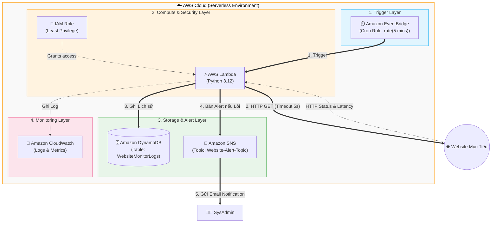

# Project: Hệ thống giám sát Website tự động (Serverless) với Infrastructure as Code

**Mức độ:** Trung bình - Khó (Xuất sắc)
**Công nghệ:** AWS Serverless (Lambda, DynamoDB, SNS, EventBridge) & Terraform (IaC).
**Chi phí:** 100% Free Tier.

---

## 1. Ý tưởng & Mục tiêu (1.0 điểm)

*   **Bối cảnh & Bài toán:** Các doanh nghiệp hoặc cá nhân cần một hệ thống giám sát thời gian thực để biết website của họ có đang hoạt động hay bị sập (downtime). Giải pháp cần tự động hóa, chi phí cực thấp (hoặc miễn phí) và cảnh báo ngay lập tức.
*   **Khách hàng:** Quản trị viên hệ thống (SysAdmin), DevOps Team, Chủ website.
*   **Giải pháp:** Xây dựng hệ thống Serverless tự động ping website mỗi 5 phút, lưu trữ độ trễ (latency) làm lịch sử và lập tức bắn Email cảnh báo nếu website không phản hồi.
*   **Tiêu chí thành công:**
    *   Hệ thống triển khai 100% tự động bằng Code (Terraform).
    *   Lưu lịch sử ping thành công vào Database.
    *   Nhận được Email cảnh báo trong vòng 1 phút kể từ khi website bị sập.

---

## 2. Kiến trúc & Thiết kế kỹ thuật (2.0 điểm)

### Sơ đồ kiến trúc (Architecture Diagram)



### Lựa chọn dịch vụ & Lý do
1.  **Amazon EventBridge (Cronjob):** Không mất phí chạy EC2 24/7 để làm máy chủ chạy cronjob. EventBridge kích hoạt chính xác theo lịch trình.
2.  **AWS Lambda (Compute):** Thực thi code Python nhanh gọn (~1s). Tiết kiệm chi phí vì chỉ tính tiền lúc code chạy.
3.  **Amazon DynamoDB (Database):** Serverless NoSQL, tốc độ ghi siêu nhanh, thiết kế theo chuẩn dạng chuỗi thời gian (Time-series).
4.  **Amazon SNS (Alerting):** Tích hợp sẵn gửi thông báo Email đơn giản mà không cần cấu hình Mail Server.
5.  **Terraform (IaC):** Tự động hóa tạo tài nguyên nhanh chóng, dễ dàng versioning và cleanup.

> [!IMPORTANT]
> **Bảo mật & IAM:** Tuân thủ **Principle of Least Privilege**. Hàm Lambda KHÔNG dùng quyền Administrator, mà được cấp một IAM Role chỉ có đúng 3 quyền: Ghi log (`logs:PutLogEvents`), Ghi database (`dynamodb:PutItem`), Gửi thông báo (`sns:Publish`). Không hard-code credentials.

---

## 3. Triển khai & Lab step-by-step (2.0 điểm)

> 📝 **LƯU Ý DÀNH CHO BẠN KHI LÀM BÁO CÁO:** Các điểm đánh dấu **[📸 YÊU CẦU SCREENSHOT]** chính là những nơi bạn phải chụp màn hình lại để chèn vào file Word/Slide báo cáo nộp cho giảng viên nhằm lấy tối đa điểm phần thực hành.

### 3.1. Prerequisite (Điều kiện tiên quyết)
*   **Tài khoản AWS:** Cần có tài khoản AWS đang hoạt động (dùng Free Tier).
*   **Region:** Khuyên dùng `us-east-1` (N. Virginia) hoặc `ap-southeast-1` (Singapore).
*   **Công cụ:** 
    *   **AWS CLI:** Cài đặt để giao tiếp với AWS. Chạy lệnh `aws configure` trong Terminal để nhập Access Key / Secret Key.
    *   **Terraform:** Download và cài đặt Terraform CLI trên máy tính.
*   **Quyền IAM cần thiết (Security Best Practice):** Trong thực tế, KHÔNG nên dùng quyền `AdministratorAccess` cho Access Key vì rủi ro bảo mật rất cao nếu lộ key. Thay vào đó, bạn nên áp dụng chuẩn **Least Privilege** (Quyền tối thiểu), cấp một IAM Policy chỉ cho phép Terraform thao tác với các dịch vụ cần thiết (Xem phụ lục ở cuối tài liệu này để lấy mẫu policy an toàn).

### 3.2. Hướng dẫn chi tiết End-to-End (Kèm CLI Guide)

**Step 1: Tạo thư mục chứa Code (CLI Guide)**
Mở Terminal / Command Prompt và chạy lệnh:
```bash
mkdir aws-monitor-project
cd aws-monitor-project
```

**Step 2: Tạo code thực thi cho Lambda (Python)**
Tạo một file tên `lambda_function.py` và dán code sau vào:

```python
import urllib.request
import urllib.error
import boto3
import time
import os
from datetime import datetime

DYNAMODB_TABLE = os.environ['DYNAMODB_TABLE']
SNS_TOPIC_ARN = os.environ['SNS_TOPIC_ARN']
TARGET_URL = os.environ['TARGET_URL']

dynamodb = boto3.resource('dynamodb')
table = dynamodb.Table(DYNAMODB_TABLE)
sns = boto3.client('sns')

def lambda_handler(event, context):
    timestamp = datetime.utcnow().isoformat()
    status_code = 0
    is_up = False
    
    start_time = time.time()
    try:
        req = urllib.request.Request(TARGET_URL, method='GET')
        with urllib.request.urlopen(req, timeout=5) as response:
            status_code = response.getcode()
            is_up = (status_code == 200)
    except urllib.error.HTTPError as e:
        status_code = e.code
    except Exception as e:
        status_code = -1 # Lỗi mạng, timeout
        
    response_time_ms = int((time.time() - start_time) * 1000)
    
    # Ghi vào DynamoDB
    table.put_item(
        Item={
            'url': TARGET_URL,
            'timestamp': timestamp,
            'status_code': status_code,
            'response_time_ms': response_time_ms,
            'is_up': is_up
        }
    )
    
    # Gửi cảnh báo
    if not is_up:
        message = f"CẢNH BÁO: Website {TARGET_URL} đang gặp sự cố!\nThời gian: {timestamp}\nStatus Code: {status_code}\nResponse Time: {response_time_ms} ms."
        sns.publish(
            TopicArn=SNS_TOPIC_ARN,
            Subject=f"ALERT: Website Down ({TARGET_URL})",
            Message=message
        )
        
    return {'statusCode': 200, 'body': f'Checked {TARGET_URL} - Status: {status_code}'}
```

**Step 3: Khai báo hạ tầng bằng Terraform**
Tạo file `main.tf` và dán toàn bộ đoạn code sau (Lưu ý: thay đổi Email nhận cảnh báo ở biến `alert_email` dòng số 7):

```hcl
provider "aws" {
  region = "us-east-1"
}

# BIẾN (VARIABLES) - HÃY SỬA EMAIL DƯỚI ĐÂY
variable "alert_email" {
  default = "email-cua-ban@gmail.com" 
}
variable "target_url" {
  default = "https://www.google.com"
}

# DYNAMODB
resource "aws_dynamodb_table" "monitor_logs" {
  name           = "WebsiteMonitorLogs"
  billing_mode   = "PAY_PER_REQUEST"
  hash_key       = "url"
  range_key      = "timestamp"
  attribute { name = "url"; type = "S" }
  attribute { name = "timestamp"; type = "S" }
}

# SNS TOPIC
resource "aws_sns_topic" "alert_topic" {
  name = "Website-Alert-Topic"
}
resource "aws_sns_topic_subscription" "email_target" {
  topic_arn = aws_sns_topic.alert_topic.arn
  protocol  = "email"
  endpoint  = var.alert_email
}

# IAM
data "aws_iam_policy_document" "lambda_assume_role" {
  statement {
    actions = ["sts:AssumeRole"]
    principals { type = "Service"; identifiers = ["lambda.amazonaws.com"] }
  }
}
resource "aws_iam_role" "lambda_role" {
  name               = "LambdaMonitorRole"
  assume_role_policy = data.aws_iam_policy_document.lambda_assume_role.json
}
resource "aws_iam_policy" "lambda_policy" {
  name = "LambdaMonitorPolicy"
  policy = jsonencode({
    Version = "2012-10-17"
    Statement = [
      { Action = ["logs:*"], Effect = "Allow", Resource = "arn:aws:logs:*:*:*" },
      { Action = "dynamodb:PutItem", Effect = "Allow", Resource = aws_dynamodb_table.monitor_logs.arn },
      { Action = "sns:Publish", Effect = "Allow", Resource = aws_sns_topic.alert_topic.arn }
    ]
  })
}
resource "aws_iam_role_policy_attachment" "attach" {
  role       = aws_iam_role.lambda_role.name
  policy_arn = aws_iam_policy.lambda_policy.arn
}

# LAMBDA
data "archive_file" "lambda_zip" {
  type        = "zip"
  source_file = "lambda_function.py"
  output_path = "lambda_function.zip"
}
resource "aws_lambda_function" "monitor_lambda" {
  filename         = "lambda_function.zip"
  function_name    = "WebsiteMonitorFunction"
  role             = aws_iam_role.lambda_role.arn
  handler          = "lambda_function.lambda_handler"
  runtime          = "python3.12"
  source_code_hash = data.archive_file.lambda_zip.output_base64sha256
  environment {
    variables = {
      DYNAMODB_TABLE = aws_dynamodb_table.monitor_logs.name
      SNS_TOPIC_ARN  = aws_sns_topic.alert_topic.arn
      TARGET_URL     = var.target_url
    }
  }
}

# EVENTBRIDGE (CRONJOB)
resource "aws_cloudwatch_event_rule" "cron" {
  name                = "every-5-minutes-monitor"
  schedule_expression = "rate(5 minutes)"
}
resource "aws_cloudwatch_event_target" "trigger" {
  rule      = aws_cloudwatch_event_rule.cron.name
  target_id = "lambda"
  arn       = aws_lambda_function.monitor_lambda.arn
}
resource "aws_lambda_permission" "allow_cloudwatch" {
  statement_id  = "AllowExecutionFromCloudWatch"
  action        = "lambda:InvokeFunction"
  function_name = aws_lambda_function.monitor_lambda.function_name
  principal     = "events.amazonaws.com"
  source_arn    = aws_cloudwatch_event_rule.cron.arn
}
```

**Step 4: Thực thi triển khai End-to-End (CLI Guide)**
Từ Terminal, gõ lệnh để tải về các file nền tảng của Terraform:
```bash
terraform init
```
Sau đó gõ lệnh để tạo toàn bộ kiến trúc lên mây:
```bash
terraform apply
```
*(Hệ thống liệt kê các resource được tạo, gõ `yes` và nhấn Enter để tiếp tục).*

> **[📸 YÊU CẦU SCREENSHOT 1]**: Ngay sau khi lệnh chạy xong, hãy chụp màn hình Terminal hiển thị dòng chữ màu xanh lá: `Apply complete! Resources: 7 added...` Đây là minh chứng bạn đã dùng CLI & IaC để deploy End-to-End thành công.

> **[📸 YÊU CẦU SCREENSHOT 2]**: Mở Email của bạn ra, tìm email từ AWS có tiêu đề "AWS Notification - Subscription Confirmation" và click vào link **Confirm subscription**. Chụp lại màn hình trình duyệt báo "Subscription confirmed!" để làm bằng chứng đã cấu hình Alert.

---

## 4. Test, Validation & Đo lường

### 4.1. Gửi request & Xem Log
Do EventBridge tự chạy mỗi 5 phút, nhưng để Demo và Test ngay lập tức, bạn có thể trigger request thủ công (Gửi request) bằng AWS CLI:
```bash
aws lambda invoke --function-name WebsiteMonitorFunction response.json
```

*   **Xem Log (Console Guide):** Truy cập AWS Console > Tìm `CloudWatch` > Chọn `Log groups` > Tìm nhóm `/aws/lambda/WebsiteMonitorFunction`. Bấm vào dòng Log stream mới nhất.
> **[📸 YÊU CẦU SCREENSHOT 3]**: Chụp toàn màn hình giao diện CloudWatch Logs hiển thị các tham số như `Init Duration`, `Duration`, `Billed Duration` của Lambda để chứng minh hệ thống Monitoring đã ghi log thành công.

### 4.2. Check Metric
*   **Console Guide:** Truy cập AWS Console > `DynamoDB` > `Explore Items` > Chọn bảng `WebsiteMonitorLogs`. 
> **[📸 YÊU CẦU SCREENSHOT 4]**: Chụp màn hình bảng DynamoDB hiển thị các bản ghi dữ liệu có `status_code = 200`, `is_up = True` và thời gian phản hồi thực tế `response_time_ms`. Đây là minh chứng luồng Data Pipeline hoạt động hoàn hảo.

### 4.3. Kiểm thử lỗi (Test Alert) & Kết quả mong đợi
Để chứng minh hệ thống cảnh báo qua Email hoạt động đúng yêu cầu:
1. Mở file `main.tf`, sửa URL mặc định thành một URL sai, ví dụ: `default = "https://www.google.com/link-bi-loi-404"`
2. Cập nhật hệ thống bằng lệnh CLI:
   ```bash
   terraform apply
   ```
3. Ép chạy ngay lập tức bằng lệnh `aws lambda invoke` bên trên.
4. **Kết quả mong đợi:** Hệ thống sẽ ngay lập tức phát hiện ra mã lỗi 404 và gửi Email cầu cứu.
> **[📸 YÊU CẦU SCREENSHOT 5]**: Mở điện thoại hoặc Email, chụp lại màn hình nhận được thư báo động đỏ: *"CẢNH BÁO: Website đang gặp sự cố! Status Code: 404"*. Bức ảnh này là then chốt để ăn trọn điểm phần Test Alert.

---

## 5. Clean-up (Thu dọn tránh chi phí phát sinh)

Để xóa toàn bộ tài nguyên đã tạo (Xóa Lambda, Xóa Stack, Delete Bucket/Alarm/Topic), thay vì click tay xóa trên console cực kỳ mệt mỏi và dễ sót, bạn chỉ cần dùng lệnh CLI sau:

```bash
terraform destroy
```
*(Gõ `yes` và nhấn Enter)*. Mọi tài nguyên sẽ tự động được thu hồi (Delete stack) sạch sẽ.

> **[📸 YÊU CẦU SCREENSHOT 6]**: Chụp lại màn hình Terminal báo `Destroy complete! Resources: 7 destroyed.` Đây là minh chứng bạn đã hoàn thành bước Clean-up và tối ưu hoá chi phí.

---

## 6. Phụ lục: IAM Policy chuẩn Least Privilege cho Terraform (Dành cho việc nâng cấp điểm bảo mật)

Khi cấu hình máy tính cá nhân chạy Terraform (thay vì cấp quyền `AdministratorAccess` rất nguy hiểm), hãy tạo một IAM User mới và gán đoạn Policy dưới đây. Policy này khóa chặt quyền của máy Terraform, chỉ cho phép tạo đúng những thứ project cần (DynamoDB, Lambda, SNS, EventBridge, IAM Role) với tên định sẵn và cấm đụng vào các tài nguyên khác trên tài khoản AWS:

```json
{
    "Version": "2012-10-17",
    "Statement": [
        {
            "Sid": "AllowTerraformDynamoDB",
            "Effect": "Allow",
            "Action": [
                "dynamodb:CreateTable",
                "dynamodb:DeleteTable",
                "dynamodb:DescribeTable",
                "dynamodb:ListTagsOfResource",
                "dynamodb:TagResource"
            ],
            "Resource": "arn:aws:dynamodb:*:*:table/WebsiteMonitorLogs"
        },
        {
            "Sid": "AllowTerraformLambda",
            "Effect": "Allow",
            "Action": [
                "lambda:CreateFunction",
                "lambda:DeleteFunction",
                "lambda:GetFunction",
                "lambda:GetFunctionConfiguration",
                "lambda:AddPermission",
                "lambda:RemovePermission"
            ],
            "Resource": "arn:aws:lambda:*:*:function:WebsiteMonitorFunction"
        },
        {
            "Sid": "AllowTerraformSNS",
            "Effect": "Allow",
            "Action": [
                "sns:CreateTopic",
                "sns:DeleteTopic",
                "sns:GetTopicAttributes",
                "sns:Subscribe",
                "sns:Unsubscribe",
                "sns:ListTagsForResource",
                "sns:TagResource"
            ],
            "Resource": "arn:aws:sns:*:*:Website-Alert-Topic"
        },
        {
            "Sid": "AllowTerraformEventBridge",
            "Effect": "Allow",
            "Action": [
                "events:PutRule",
                "events:DeleteRule",
                "events:DescribeRule",
                "events:PutTargets",
                "events:RemoveTargets",
                "events:ListTagsForResource"
            ],
            "Resource": "arn:aws:events:*:*:rule/every-5-minutes-monitor"
        },
        {
            "Sid": "AllowTerraformIAMRole",
            "Effect": "Allow",
            "Action": [
                "iam:CreateRole",
                "iam:DeleteRole",
                "iam:GetRole",
                "iam:PassRole",
                "iam:CreatePolicy",
                "iam:DeletePolicy",
                "iam:GetPolicy",
                "iam:GetPolicyVersion",
                "iam:AttachRolePolicy",
                "iam:DetachRolePolicy",
                "iam:ListInstanceProfilesForRole",
                "iam:ListRolePolicies",
                "iam:ListAttachedRolePolicies"
            ],
            "Resource": [
                "arn:aws:iam::*:role/LambdaMonitorRole",
                "arn:aws:iam::*:policy/LambdaMonitorPolicy"
            ]
        }
    ]
}
```
