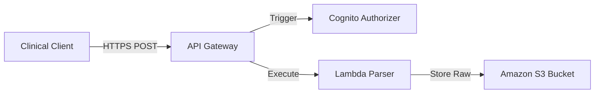

# A Serverless Design Pattern for Ingesting Healthcare Data

### 1. The Challenges of Healthcare Data Ingestion
Healthcare facilities generate data in diverse formats (HL7v2, FHIR, DICOM images, and raw CSV telemetry from devices). Ingesting these files requires high throughput, elastic scalability, and strict security isolation to protect data in transit. 

Legacy architectures rely on dedicated servers running constantly, which are both cost-inefficient and difficult to maintain. Using a serverless design pattern on AWS eliminates idle servers and automates scalability.

---

### 2. High-Level Serverless Architecture
The serverless ingestion pipeline uses the following core services:
- **Amazon API Gateway**: Acts as the secure interface endpoint for external clients, authorizing requests using Amazon Cognito.
- **AWS Lambda**: Validates and parses incoming files, sending them to structured storage.
- **Amazon S3**: Serves as the landing zone (data lake storage) for raw files.

---

### 3. Practical Implementation Details
To prevent memory exhaustion in Lambda functions when uploading large telemetry files (e.g., MRI scans or long-running ECG logs), the pipeline can use **S3 Presigned URLs**:
1. The client requests a upload path from API Gateway.
2. Lambda generates a unique, temporary **S3 Presigned URL** and returns it to the client.
3. The client uploads the binary payload directly to S3.
4. An S3 Event Trigger automatically runs a secondary Lambda parser to validate the uploaded clinical data.

---

### 4. Benefits
- **Cost Optimization**: You only pay for the execution time of the validation Lambda functions.
- **High Security**: External systems never get direct access to storage credentials; they only receive short-lived, single-use S3 upload paths.
- **Resilience**: The architecture scales automatically to handle burst traffic during peak hours without operational overhead.

