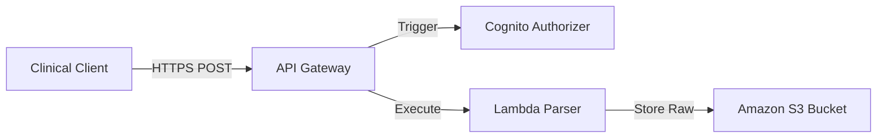

# Mô hình thiết kế Serverless để thu nhập dữ liệu y tế

### 1. Thách thức trong việc thu thập dữ liệu y tế
Các cơ sở y tế tạo ra dữ liệu ở nhiều định dạng khác nhau (HL7v2, FHIR, hình ảnh DICOM và dữ liệu đo lường CSV thô từ các thiết bị). Thu thập các tệp này đòi hỏi thông lượng cao, khả năng mở rộng linh hoạt và cách ly bảo mật nghiêm ngặt để bảo vệ dữ liệu trong quá trình truyền tải.

Kiến trúc cũ dựa trên các máy chủ chuyên dụng chạy liên tục, vừa không tối ưu chi phí vừa khó bảo trì. Sử dụng mô hình thiết kế serverless trên AWS giúp loại bỏ máy chủ rảnh rỗi và tự động hóa khả năng mở rộng.

---

### 2. Kiến trúc Serverless tổng quan
Quy trình thu thập dữ liệu serverless sử dụng các dịch vụ cốt lõi sau:
- **Amazon API Gateway**: Đóng vai trò là điểm cuối giao diện an toàn cho các ứng dụng khách bên ngoài, xác thực các yêu cầu bằng Amazon Cognito.
- **AWS Lambda**: Xác thực và phân tích cú pháp các tệp đầu vào, gửi chúng đến bộ nhớ lưu trữ có cấu trúc.
- **Amazon S3**: Đóng vai trò là vùng hạ cánh (landing zone) để lưu trữ các tệp thô ban đầu.

---

### 3. Chi tiết triển khai thực tế
Để ngăn ngừa tình trạng cạn kiệt bộ nhớ trong các hàm Lambda khi tải lên các tệp dữ liệu lớn (ví dụ: chụp cộng hưởng từ MRI hoặc nhật ký điện tâm đồ ECG chạy liên tục), quy trình này sử dụng **S3 Presigned URL**:
1. Khách hàng yêu cầu một đường dẫn tải lên từ API Gateway.
2. Lambda tạo ra một **S3 Presigned URL** duy nhất, tạm thời và trả lại cho khách hàng.
3. Khách hàng tải trực tiếp tệp dữ liệu lên S3 thông qua URL này.
4. Một S3 Event Trigger sẽ tự động kích hoạt một hàm Lambda thứ hai để phân tích cú pháp và xác thực dữ liệu lâm sàng vừa được tải lên.

---

### 4. Lợi ích
- **Tối ưu hóa chi phí**: Bạn chỉ trả tiền cho thời gian chạy thực tế của các hàm Lambda xác thực.
- **Bảo mật cao**: Các hệ thống bên ngoài không bao giờ có quyền truy cập trực tiếp vào thông tin xác thực lưu trữ; chúng chỉ nhận được đường dẫn tải lên S3 dùng một lần và tồn tại trong thời gian ngắn.
- **Khả năng phục hồi**: Kiến trúc tự động mở rộng quy mô để xử lý lưu lượng truy cập tăng đột biến vào giờ cao điểm mà không cần quản lý vận hành.

