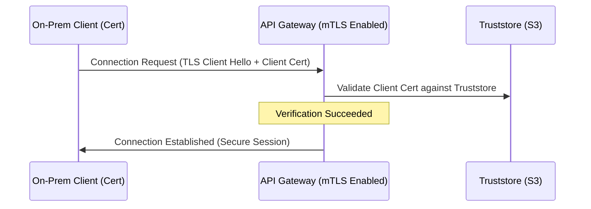

# Securing API Integrations in Hybrid Cloud Environments

### 1. Hybrid Workloads Integration Patterns
Large enterprises and institutions frequently integrate local, on-premises systems with modern applications running on AWS. In this **hybrid cloud model**, data routes between corporate data centers and public AWS VPCs.

Securing API integrations across these two distinct boundaries requires strong network path boundaries and validation.

---

### 2. Network Security with AWS VPC Endpoints
Exposing APIs to the public internet, even when authenticated with API keys, introduces vulnerability vectors (such as DDoS attacks and scanning tools). To avoid this risk, routing should remain private.

By utilizing **VPC Endpoints (AWS PrivateLink)**, we can route traffic internally through AWS private fibers:
- **Interface Endpoints**: Create elastic network interfaces (ENIs) inside subnets, mapping private IP addresses to target AWS services.
- **Gateway Endpoints**: Modify VPC route tables to redirect S3 and DynamoDB traffic directly, bypass internet gateways completely, and utilize VPC Endpoint Policies to restrict access boundaries.

---

### 3. Mutual TLS (mTLS) and Certificate Validation
For hybrid APIs exposed over HTTP endpoints, standard HTTPS only validates the server's identity to the client. **Mutual TLS (mTLS)** enforces two-way verification: the server also validates the client's TLS certificate.

Amazon API Gateway supports mTLS by referencing a truststore of approved certificate authorities (CAs) uploaded to Amazon S3:

---

### 4. Summary
Securing hybrid integrations requires combining multiple security layers. Using VPC Endpoints protects the network layer from public exposure, and mTLS verifies the integrity of requesting systems at the protocol layer.

