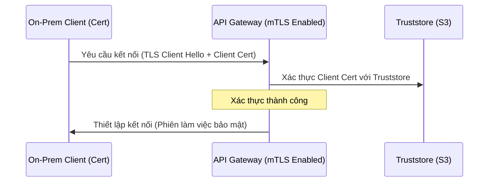

# Bảo mật tích hợp API trong môi trường Hybrid Cloud

### 1. Các mô hình tích hợp ứng dụng Hybrid
Các doanh nghiệp lớn và cơ quan thường xuyên tích hợp hệ thống máy chủ cục bộ (on-premises) với các ứng dụng hiện đại đang chạy trên AWS. Trong **mô hình đám mây lai (hybrid cloud)** này, dữ liệu sẽ di chuyển liên tục giữa các trung tâm dữ liệu doanh nghiệp và mạng VPC trên AWS.

Bảo mật tích hợp API giữa hai ranh giới riêng biệt này đòi hỏi phải có các chính sách phân quyền mạng và kiểm tra thông tin nghiêm ngặt.

---

### 2. Bảo mật mạng với AWS VPC Endpoint
Việc mở các endpoint gọi API ra internet công cộng, ngay cả khi được xác thực bằng API key, sẽ tạo ra các nguy cơ bị tấn công (như tấn công từ chối dịch vụ DDoS và rò rỉ thông tin). Để loại bỏ rủi ro này, dữ liệu nên được định tuyến trong mạng nội bộ.

Bằng cách sử dụng **VPC Endpoint (AWS PrivateLink)**, chúng ta có thể định tuyến lưu lượng truy cập nội bộ thông qua đường truyền mạng riêng của AWS:
- **Interface Endpoints**: Tạo các interface mạng ảo (ENI) trong subnets, gán địa chỉ IP private cho các dịch vụ AWS đích.
- **Gateway Endpoints**: Sửa đổi route table của VPC để chuyển hướng lưu lượng truy cập tới S3 hoặc DynamoDB trực tiếp, bỏ qua hoàn toàn internet gateway và áp dụng VPC Endpoint Policy để giới hạn phạm vi truy cập.

---

### 3. Mutual TLS (mTLS) và Xác thực chứng chỉ
Đối với các API hybrid được mở qua HTTP endpoint công cộng, giao thức HTTPS thông thường chỉ xác thực danh tính của máy chủ với máy khách. **Mutual TLS (mTLS)** thực thi xác thực hai chiều: máy chủ cũng xác thực chứng chỉ TLS của máy khách.

Amazon API Gateway hỗ trợ mTLS bằng cách tham chiếu đến một tệp truststore chứa các chứng chỉ CA được phê duyệt tải lên Amazon S3:

---

### 4. Tóm tắt
Bảo mật tích hợp hybrid đòi hỏi phải kết hợp nhiều lớp bảo vệ. Sử dụng VPC Endpoint bảo vệ lớp mạng khỏi sự tiếp xúc trực tiếp từ internet, trong khi mTLS kiểm tra tính xác thực của hệ thống gửi yêu cầu ở lớp giao thức.

