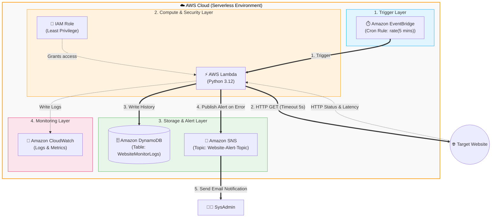

### 1. Architectural Diagram

### 2. Service Selection & Rationale
1.  **Amazon EventBridge (Cronjob):** Serverless scheduler. Replaces continuous EC2 instances to eliminate 24/7 runtime billing.
2.  **AWS Lambda (Compute):** Executes lightweight Python code quickly (~1s) and incurs zero cost when inactive.
3.  **Amazon DynamoDB (Database):** Serverless NoSQL time-series data storage with fast writes.
4.  **Amazon SNS (Alerting):** Simple email delivery without configuring complex SMTP mail servers.
5.  **Terraform (IaC):** Streamlines infrastructure staging, updating, and dismantling.

> [!IMPORTANT]
> **Security & IAM (Least Privilege):** Follows the **Principle of Least Privilege**. The Lambda function is granted limited execution policies allowing only S3 log streaming (`logs:PutLogEvents`), DynamoDB table insertions (`dynamodb:PutItem`), and SNS messaging (`sns:Publish`). Credentials are not hard-coded.
