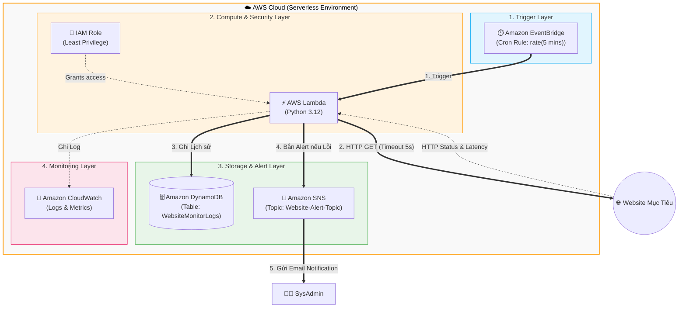

### 1. Sơ đồ kiến trúc (Architecture Diagram)

### 2. Lựa chọn dịch vụ & Lý do
1.  **Amazon EventBridge (Cronjob):** Không mất phí chạy EC2 24/7 để làm máy chủ chạy cronjob. EventBridge kích hoạt chính xác theo lịch trình.
2.  **AWS Lambda (Compute):** Thực thi code Python nhanh gọn (~1s). Tiết kiệm chi phí vì chỉ tính tiền lúc code chạy.
3.  **Amazon DynamoDB (Database):** Serverless NoSQL, tốc độ ghi siêu nhanh, thiết kế theo chuẩn dạng chuỗi thời gian (Time-series).
4.  **Amazon SNS (Alerting):** Tích hợp sẵn gửi thông báo Email đơn giản mà không cần cấu hình Mail Server.
5.  **Terraform (IaC):** Tự động hóa tạo tài nguyên nhanh chóng, dễ dàng dựng/hủy tài nguyên sạch sẽ.

> [!IMPORTANT]
> **Bảo mật & IAM:** Tuân thủ **Principle of Least Privilege**. Hàm Lambda KHÔNG dùng quyền Administrator, mà được cấp một IAM Role chỉ có đúng 3 quyền: Ghi log (`logs:PutLogEvents`), Ghi database (`dynamodb:PutItem`), Gửi thông báo (`sns:Publish`). Không hard-code credentials.
